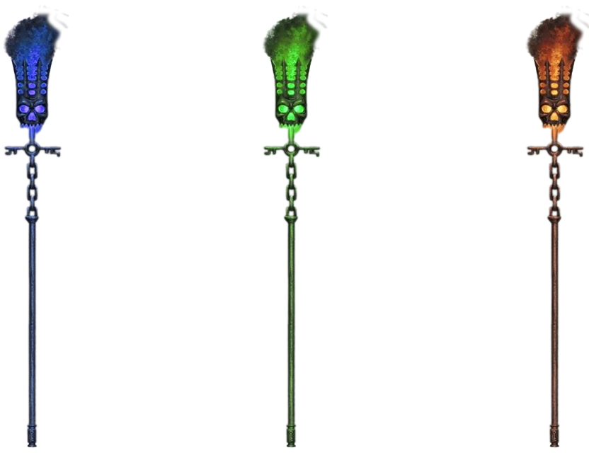

  

An Utter Masterpiece&trade; By

Julia Bullard <github.com/Julia-5534>

Mason Counts <github.com/spindouken>

This Utter Masterpiece&trade; is a loving homage to the late Flappy Bird mobile app game.

But what if instead of Flappy Bird, we played as DEATH RIDING A SCYTHE?!

And what if instead of wings flapping, it was in fact Death's flatulence propelling you forward?!

AND WHAT IF Death travelled from a Graveyard, through the River Styx, and into the fiery depths of Hell?!

WONDER NO MORE! Death Farts is here to quell all those curiosities!

## :book: Table of Contents :book:
* [Environment](#environment)
* [Installation](#installation)
* [IPS](#IPS)
* [Future Functionalities](#future-functionalities)
* [Bugs](#bugs)
* [Authors](#authors)
* [License](#license)

## :computer: Environment :computer:
This project is interpreted/tested on Ubuntu 20.04 LTS using python3

## :cd: Installation :cd:
* Clone the repository: `git clone https://github.com/Julia-5534/DF.git`
* Access the Death Farts directory: `cd DF`
* Run Death Farts: `python3 dftest.py`

## :bulb: IPS :bulb:
- What do we use for our "pipes"?
    - Lantern Staff in three different colors, one for each of our three backgrounds.

  

- How do we implement a seamless side scrolling background?
    - Mirror your image and save it as a separate file.
    - Double the width of your canvas size on your OG image, shift OG image to the left.
    - Place your mirrored image on the right side of the canvas. Voila!
** INSERT PICS OF STEPS **

  
  
  

- How can we easily make our three backgrounds blend together better?
    - Add clouds to the top of the background images to help create a slight illusion of seamless blending

  
  
  

- How do we implement a leaderboard?
    - Put Masons steps in here
** INSERT GIF OF LEADERBOARD **
- How do we delay the obstacles in the beginning so you don't immediately crash?
    - Add a function to the game screen where you have to tap once for the game to start.
** INSERT GIFS OF GAME WITH NO TAP & GAME WITH TAP **
- How do we implement the farts?!
    - Use the same image but in three different colors, one for each background.
    - Use pygame.transform.scale() & pygame.Surface
        - Increases the size of the farts while they fade away
** INSERT GIF OF FART MOVEMENT **
- Why does the game look like everything's moving weird?
    - The base and lanterns need to move at the same speed. No more motion sickness!
** INSERT GIF OF SHITTY VELOCITY **
- Why does tapping on the Game Over Screen register on the Main Menu Screen?
    - Need to clear the input buffer
    - Use pygame.event.clear()
        - Taps no longer register on the Game Over Screen
** INSERT GIFS OF GAME OVER SCREEN WITH NO CLEARED BUFFER & WITH CLEARED BUFFER **
- Why does the fart placement look a little off?
    - Needed to lower the placement of the fart
        - Makes the fart flow look much more natural

## :robot: Future Functionalities :robot:
- Super charged fart
- Make intermediate images so the backgrounds fully transition and blend into each other
- Have Death squint when he farts
- Have multiple difficulty levels (perhaps a Fury Mode?)
- Have Death fart & fly by on the Main Menu Screen
- Have the Main Menu Screen scroll into the actual gameplay
- Have Death squint, fart, & fly by on the Game Over Screen

## :beetle: Bugs :beetle:
No known bugs at this time.

## :memo: Authors :memo:
Julia Bullard - [Github](https://github.com/Julia-5534)

Mason Count - [Github](https://github.com/spindouken) 

## :scroll: License :scroll:
No touchy! (Insert photo of Llama Cuzco. No, don't. Disney would totally sue.)
